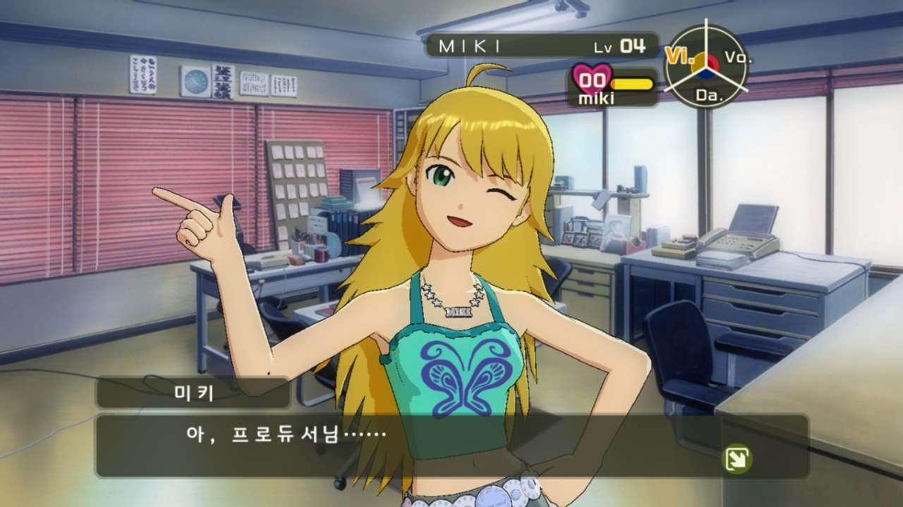
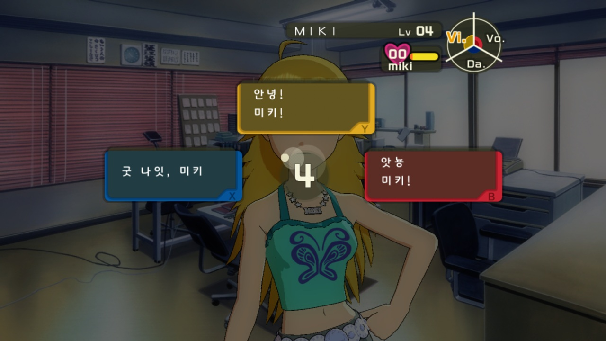
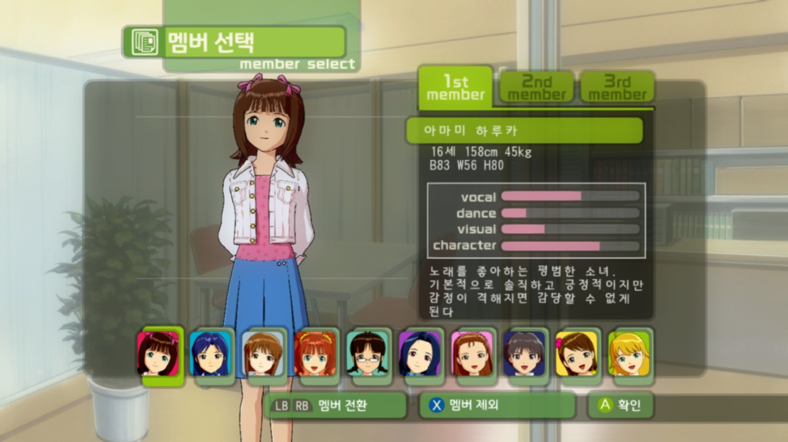

# 아이돌마스터 XBOX 360 한글 패치 (AI 번역)

## 개요

XBOX 360으로 발매된 THE iDOLM@STER의 한글패치를 제공하는 프로그램입니다.

## 샘플 이미지

## 지원되는 기능
* 대부분의 일본어 텍스트 및 일본어 이미지 한글로 교체
* 치트 옵션 제공
  * 오디션에서 얻는 팬수 2배
  * 오디션의 합격자 수를 최소 2명으로 설정

## 패치 방법
* 프로그램을 실행시키빈다.
* 원본 iso 파일을 드래그 & 드롭 합니다.
* [한글 패치] 버튼을 눌러 패치를 진행 합니다.
* 패치된 iso 파일은 _repacked 이름이 추가되어 원본 iso와 같은 경로에 저장됩니다.

## 요구사항
* Windows 10 이상
* 아이마스 일반판 ISO or 플래티넘판 ISO

## 미번역 리스트
* 가사 레슨의 가사
* 라이브시의 노래 가사
* 레슨의 임시휴업/성공/실패 등 배경에 그라데이션이 들어간 버튼
* 기타 발견하지 못한 이미지들

Build with GPT-5.5 · Translated with Gemma 4 & Gemini
